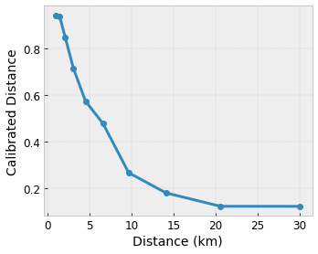
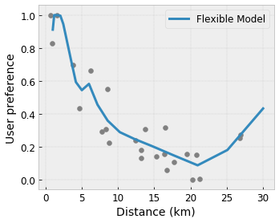
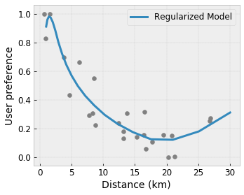
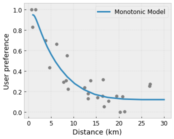

# TensorFlow Lattice (TFL)

TensorFlow Lattice is a library that implements flexible, controlled and
interpretable lattice based models. The library enables you to inject domain
knowledge into the learning process through common-sense or policy-driven
[shape constraints](tutorials/shape_constraints.ipynb). This is done using a
collection of [Keras layers](tutorials/keras_layers.ipynb) that can satisfy
constraints such as monotonicity, convexity and pairwise trust. The library also
provides easy to setup [canned estimators](tutorials/canned_estimators.ipynb).

## Concepts

This section is a simplified version of the description in
[Monotonic Calibrated Interpolated Look-Up Tables](http://jmlr.org/papers/v17/15-243.html)
, JMLR 2016.

### Lattices

A *lattice* is an interpolated look-up table that can approximate arbitrary
input-output relationships in your data. It overlaps a regular grid onto your
input space and learns values for the output in the vertices of the grid. For a
test point $x$, $f(x)$ is linearly interpolated from the lattice values
surrounding $x$.

The simple example above is a function with 2 input features and 4 parameters:
$\theta=[0, 0.2, 0.4, 1]$, which are the function's values at the corners of the
input space; the rest of the function is interpolated from these parameters.

The function $f(x)$ can capture non-linear interactions between features. You
can think of the lattice parameters as the height of poles set in the ground on
a regular grid, and the resulting function is like cloth pulled tight against
the four poles.

With $D$ features and 2 vertices along each dimension, a regular lattice will
have $2^D$ parameters. To fit a more flexible function, you can specify a
finer-grained lattice over the feature space with more vertices along each
dimension. Lattice regression functions are continuous and piecewise infinitely
differentiable.

### Calibration

Let's say the preceding sample lattice represents a learned *user happiness*
with a suggested local coffee shop calculated using features:

*   coffee price, in range 0 to 20 dollars
*   distance to the user, in range 0 to 30 kilometers

We want our model to learn user happiness with a local coffee shop suggestion.
TensorFlow Lattice models can use *piecewise linear functions* (with
`tfl.layers.PWLCalibration`) to calibrate and normalize the input features to
the range accepted by the lattice: 0.0 to 1.0 in the example lattice above. The
following show examples such calibrations functions with 10 keypoints:

It is often a good idea to use the quantiles of the features as input keypoints.
TensorFlow Lattice [canned estimators](tutorials/canned_estimators.ipynb) can
automatically set the input keypoints to the feature quantiles.

For categorical features, TensorFlow Lattice provides categorical calibration
(with `tfl.layers.CategoricalCalibration`) with similar output bounding to feed
into a lattice.

### Ensembles

The number of parameters of a lattice layer increases exponentially with the
number of input features, hence not scaling well to very high dimensions. To
overcome this limitation, TensorFlow Lattice offers ensembles of lattices that
combine (average) several *tiny* lattices, which enables the model to grow
linearly in the number of features.

The library provides two variations of these ensembles:

*   **Random Tiny Lattices** (RTL): Each submodel uses a random subset of
    features (with replacement).

*   **Crystals** : The Crystals algorithm first trains a *prefitting* model that
    estimates pairwise feature interactions. It then arranges the final ensemble
    such that features with more non-linear interactions are in the same
    lattices.

## Why TensorFlow Lattice ?

You can find a brief introduction to TensorFlow Lattice in
[Google AI's Blog post](https://research.googleblog.com/).

### Interpretability

Since the parameters of each layer are the output of that layer, it is easy to
analyze, understand and debug each part of the model.

### Accurate and Flexible Models

Using fine-grained lattices, you can get *arbitrarily complex* functions with a
single lattice layer. Using multiple layers of calibrators and lattices often
work nicely in practice and can match or outperform DNN models of similar sizes.

### Common-Sense Shape Constraints

Real world training data is often a somewhat biased representation of where the
model will be applied.

Unconstrained and flexible ML solutions such as DNNs or decision trees often act
unexpectedly in parts of the input space not covered by the training data. Even
though common forms of regularization can reduce nonsensical extrapolation, it
is hardly enough to guarantee reasonable model behaviour across the entire input
space.

TensorFlow Lattice provides several types of *semantic regularization* through
[shape constraints](tutorials/shape_constraints.ipynb):

*   **Monotonicity**: You can specify that the output should only
    increase/decrease with respect to an input. In our example, you may want to
    specify that increased distance to a coffee shop should only decrease the
    predicted user preference.

 

*   **Convexity/Concavity**: You can specify that the function shape can be
    convex or concave. Mixed with monotonicity, this can force the function to
    represent diminishing returns with respect to a given feature.

*   **Unimodality**: You can specify that the function should have a unique peak
    or unique valley. This let you represent functions that have a *sweet spot*
    with respect to a feature.

*   **Pairwise trust**: This constraint works on a pair of features and suggests
    that one input feature semantically reflects trust in another feature. For
    example, higher number of reviews makes you more confident in the average
    star rating of a restaurant. The model will be more sensitive with respect
    to the star rating (i.e. will have a larger slope with respect to the
    rating) when the number of reviews is higher.

### Controlled Flexibility with Regularizers

In addition to shape constraints, TensorFlow lattice provides a number of
regularizers to control the flexibility and smoothness of the function for each
layer.

*   **Laplacian Regularizer**: Outputs of the lattice/calibration
    vertices/keypoints are regularized towards the values of their respective
    neighbors. This results in a *flatter* function.

*   **Hessian Regularizer**: This penalizes the first derivative of the PWL
    calibration layer to make the function *more linear*.

*   **Wrinkle Regularizer**: This penalizes the second derivative of the PWL
    calibration layer to avoid sudden changes in the curvature. It makes the
    function smoother.

*   **Torsion**: Outputs of the lattice will be regularized towards preventing
    torsion among the features. In other words, the model will be regularized
    towards independence between the contributions of the features.

### Mix and match with other Keras layers

You can use TF Lattice layers in combination with other Keras layers to
construct partially constrained or regularized models. For example, lattice or
PWL calibration layers can be used at the last layer of deeper networks that
include embeddings or other Keras layers.

## Papers

*   [Shape Constraints for Set Functions](http://proceedings.mlr.press/v97/cotter19a.html),
    Andrew Cotter, Maya Gupta, H. Jiang, Erez Louidor, Jim Muller, Taman
    Narayan, Serena Wang, Tao Zhu. International Conference on Machine Learning
    (ICML), 2019
*   [Diminishing Returns Shape Constraints for Interpretability and
    Regularization](https://papers.nips.cc/paper/7916-diminishing-returns-shape-constraints-for-interpretability-and-regularization),
    Maya Gupta, Dara Bahri, Andrew Cotter, Kevin Canini, Advances in Neural
    Information Processing Systems (NeurIPS), 2018
*   [Deep Lattice Networks and Partial Monotonic Functions](https://research.google.com/pubs/pub46327.html),
    Seungil You, Kevin Canini, David Ding, Jan Pfeifer, Maya R. Gupta, Advances
    in Neural Information Processing Systems (NeurIPS), 2017
*   [Fast and Flexible Monotonic Functions with Ensembles of Lattices](https://papers.nips.cc/paper/6377-fast-and-flexible-monotonic-functions-with-ensembles-of-lattices),
    Mahdi Milani Fard, Kevin Canini, Andrew Cotter, Jan Pfeifer, Maya Gupta,
    Advances in Neural Information Processing Systems (NeurIPS), 2016
*   [Monotonic Calibrated Interpolated Look-Up Tables](http://jmlr.org/papers/v17/15-243.html),
    Maya Gupta, Andrew Cotter, Jan Pfeifer, Konstantin Voevodski, Kevin Canini,
    Alexander Mangylov, Wojciech Moczydlowski, Alexander van Esbroeck, Journal
    of Machine Learning Research (JMLR), 2016
*   [Optimized Regression for Efficient Function Evaluation](http://ieeexplore.ieee.org/document/6203580/),
    Eric Garcia, Raman Arora, Maya R. Gupta, IEEE Transactions on Image
    Processing, 2012
*   [Lattice Regression](https://papers.nips.cc/paper/3694-lattice-regression),
    Eric Garcia, Maya Gupta, Advances in Neural Information Processing Systems
    (NeurIPS), 2009

## Tutorials and API docs

You can use [Canned Estimators](tutorials/canned_estimators.ipynb) or
[Keras Layers](tutorials/keras_layers.ipynb). Check out
[full API docs](api_docs/python/tfl.ipynb) for details.
